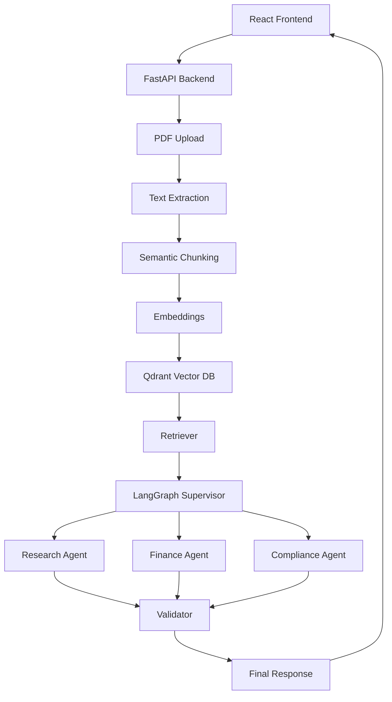

# Enterprise RAG Architecture

## Overview

Enterprise-grade Multi-Agent RAG system built using:

* React + Vite Frontend
* FastAPI Backend
* LangGraph Multi-Agent Workflow
* Qdrant Vector Database
* Sentence Transformers Embeddings
* PDF Upload and Processing
* Retrieval Augmented Generation (RAG)

## Architecture

## Features

* PDF Upload
* PDF Text Extraction
* Semantic Chunking
* Embedding Generation
* Vector Storage using Qdrant
* Retrieval-Augmented Generation
* LangGraph Agent Workflow
* Research Agent
* Finance Agent
* Compliance Agent
* Validator Agent

## Tech Stack

### Frontend

* React
* TypeScript
* Vite

### Backend

* FastAPI
* LangGraph
* Sentence Transformers
* Qdrant
* PyPDF

## Workflow

1. Upload PDF
2. Extract Text
3. Chunk Text
4. Generate Embeddings
5. Store in Qdrant
6. Retrieve Relevant Chunks
7. Pass Context to Research Agent
8. Run Finance Agent
9. Run Compliance Agent
10. Validate Results
11. Return Final Analysis

## Example Query

"What are Tesla's major business risks?"

## Future Enhancements

* Cross Encoder Re-ranking
* Hybrid Search (BM25 + Vector)
* Multi-PDF Support
* Agent Memory Expansion
* Deployment on AWS / Azure

 Architecture

# Workflow

# Screenshots

## PDF Upload

## Tesla Analysis

## Swagger UI

## Author
Marree Jachaak