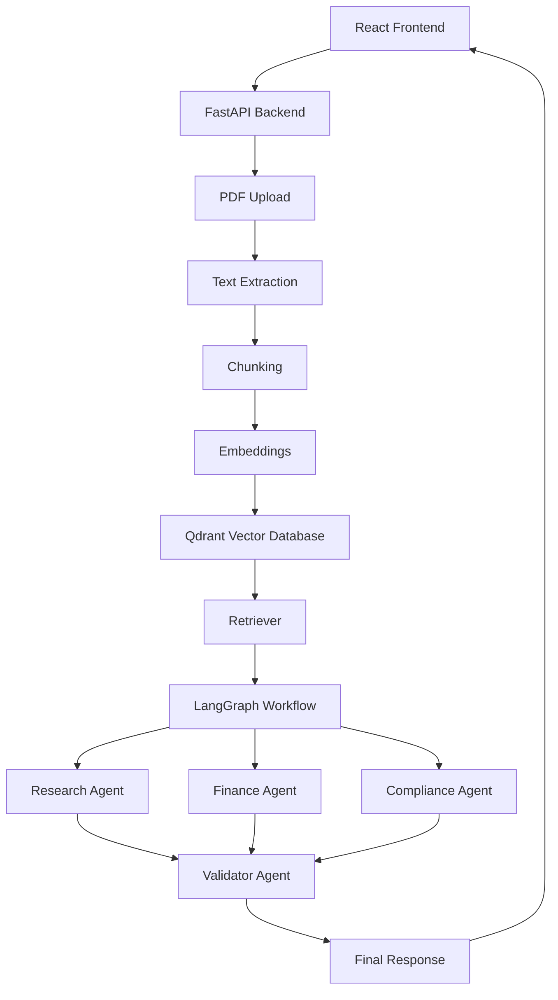
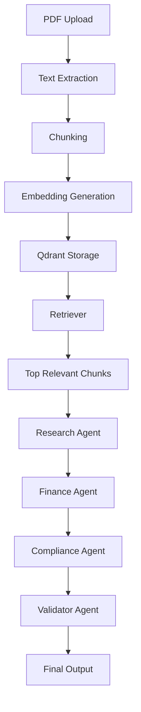
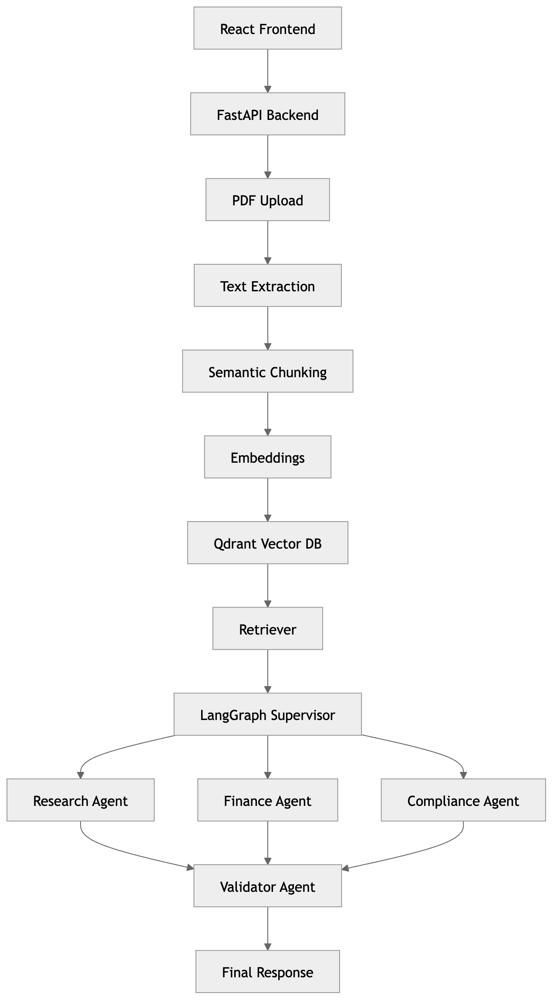

# 🚀 Qwen Agent Society - Enterprise RAG System

## Overview

Enterprise-grade Multi-Agent Retrieval-Augmented Generation (RAG) system built using modern AI and agentic workflows.

### Key Capabilities

* PDF Upload & Processing
* Text Extraction
* Semantic Chunking
* Embedding Generation
* Qdrant Vector Database
* Semantic Retrieval
* LangGraph Multi-Agent Workflow
* Research Analysis
* Finance Analysis
* Compliance Analysis
* Validation & Final Response

---

# 🏗️ System Architecture



---

# 🔄 RAG Workflow



---

# ✨ Features

* PDF Upload
* PDF Text Extraction
* Semantic Chunking
* Embedding Generation
* Vector Storage using Qdrant
* Retrieval-Augmented Generation (RAG)
* LangGraph Agent Workflow
* Research Agent
* Finance Agent
* Compliance Agent
* Validator Agent
* Agent Memory
* Multi-Agent Analysis Dashboard

---

# 🛠️ Technology Stack

## Frontend

* React
* TypeScript
* Vite

## Backend

* FastAPI
* LangGraph
* Qdrant
* Sentence Transformers
* PyPDF
* Python

## AI Components

* Embeddings
* Vector Search
* Retrieval-Augmented Generation
* Multi-Agent Reasoning

---

# 📂 Project Structure

```text
backend/
├── agents/
├── api/
├── database/
├── graph/
├── memory/
├── services/
└── main.py

frontend/
├── src/
│   ├── services/
│   └── App.tsx

docs/
└── screenshots/
```

---

# 🚀 How It Works

1. Upload PDF
2. Extract Text
3. Chunk Text
4. Generate Embeddings
5. Store Vectors in Qdrant
6. Retrieve Relevant Chunks
7. Inject Context into LangGraph
8. Execute Research Agent
9. Execute Finance Agent
10. Execute Compliance Agent
11. Execute Validator Agent
12. Return Final Analysis

---

# 🔍 Example Query

```text
What are Tesla's major business risks?
```

Example analyses:

* Risk Assessment
* Investment Outlook
* Compliance Review
* Strategic Analysis
* Workforce Risk Evaluation
* Competitive Landscape Review

---

# 📸 Architecture Diagram


---

# 📸 Workflow Diagram



---


---

# 📊 Project Status

## Frontend

* ✅ React
* ✅ Vite
* ✅ TypeScript
* ✅ PDF Upload UI
* ✅ Analysis Dashboard
* ✅ Memory Viewer

## Backend

* ✅ FastAPI
* ✅ LangGraph
* ✅ Research Agent
* ✅ Finance Agent
* ✅ Compliance Agent
* ✅ Validator Agent

## Retrieval-Augmented Generation (RAG)

* ✅ PDF Upload
* ✅ PDF Text Extraction
* ✅ Chunking
* ✅ Embedding Generation
* ✅ Qdrant Vector Database
* ✅ Semantic Retrieval
* ✅ Context Injection into Agents

## Build & Deployment Readiness

* ✅ React Production Build Passed
* ✅ TypeScript Compilation Passed
* ✅ Vite Build Passed
* ✅ FastAPI Backend Running
* ✅ API Endpoints Tested
* ✅ Ready for Deployment

---

# 🔮 Future Enhancements

* Cross-Encoder Re-ranking
* Hybrid Search (BM25 + Vector Search)
* Multi-PDF Support
* Persistent Qdrant Storage
* Cloud Deployment (Railway / Render / Vercel)
* Advanced Agent Memory
* Human-in-the-Loop Review
* Multi-Modal Document Processing

---

# 👨‍💻 Author

**Marree Jachaak**

AI Engineer | Agentic AI | LangGraph | RAG Systems | FastAPI | React
